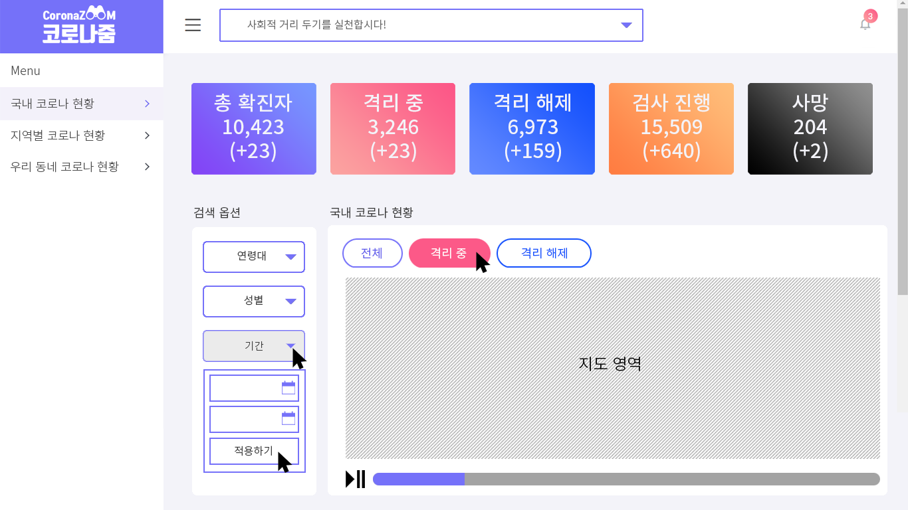

### ////// 변경 사항 //////

여기서 변경사항 이야기 하면 됩니다!

CoronaZoom_WEB
===================
#### 호흡기 전염병(COVID-19) 역학조사를 위한 시각화 웹 플랫폼 REPOSITORY

## Team Member
###### 세종대학교 소프트웨어학과 캡스톤디자인 (Sejong University Dept. of Software Capstone Design 2020)
|이름|github ID|역할|
|------|---|---|
|김슬기|@4z7l||
|전승현|@jsh5408||
|박세원|@bigwon9999||
|황준철|@JJunCH014||

코로나줌(CoronaZoom)
===================

[코로나줌](http://ec2-13-125-253-144.ap-northeast-2.compute.amazonaws.com/)

#### 메인 페이지
</img>

1.아키텍쳐 설계 (Architecture Design)
------------------------------------
</img>

</img>

### 1-1.개발 환경(Development Environment)
* AWS EC2 - Ubuntu
* MySQL

2.UI 설계 (UI Design)
------------------------------------
</img>

</img>

</img>

</img>

</img>

3.데이터베이스 설계 (Database Design)
------------------------------------

</img>
